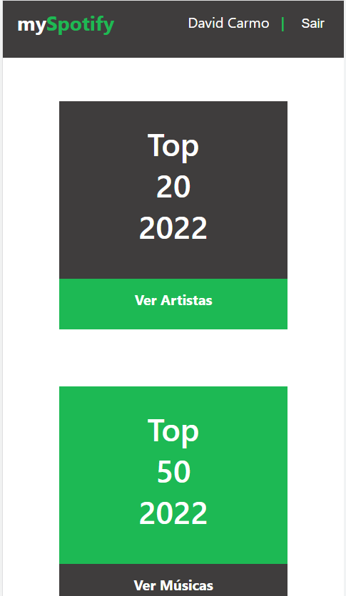

<h1 align="center"> 
  mySpotify
</h1>

Aplicação que permite ao usuário conferir os seus 20 artistas e 50 músicas mais ouvidas no Spotify durante o corrente ano.
Projeto desenvolvido com o intuito de comprender melhor a utilização do API-Auth do NextJS e o consumo de APIS que utilizam OAauth. 

<section>
  <h2>Funcionalidade </h2>
  
A aplicação lista músicas e artistas beseados no dados fornecidos pela api Spotify de acordo com a conta do usuário  

</section>

<section>
<h2> 
 Layout
</h2>

  <h2> 
    Web
  </h2>
  

<h2>
Mobile
</h2>

</section>

<section>
  <h2> Tecnologias Utilizadas </h2>
  <ul>
    <li>NextJS</li>
    <li>SASS</li>
  </ul>
</section>

<section> 
  <h2>Pré-Requisitos e Iniciando a aplicação </h2>
  
É necessário a criação de uma conta no spotify como developer e criar uma aplicação para o funcionamento da aplicação.  
  Necessário a criação de uma .env.local com os dados adquiridos no dashboard da Api do Spotify.  
  Spotify Dashboard: <a> https://developer.spotify.com/dashboard/login </a>
  

  <ul> 
    <h4>Variáveis a serem criadas na .env.local </h4>
  <li>SPOTIFY_CLIENT_ID=</li> 
  <li>SPOTIFY_CLIENT_SECRET=</li> 
  <li>BASE_URL=</li>
    </ul>
  

  <ol>
  <h3>Passos: </h3>
    <li>Crie o seu app no dashboard da api spotify </li>
    <li>Insira a URL de callback http://localhost:3000/api/auth/callback/spotify no app criado no dashboard </li>
    <li>Clone a aplicação</li>
    <li>Instale as dependências</li>
    <li>Crie o .env.local e informe os dados do seu Spotify APP</li>
    <li>Rode a aplicação com yarn dev ou npm run dev</li>
  </ol>
  

</section
